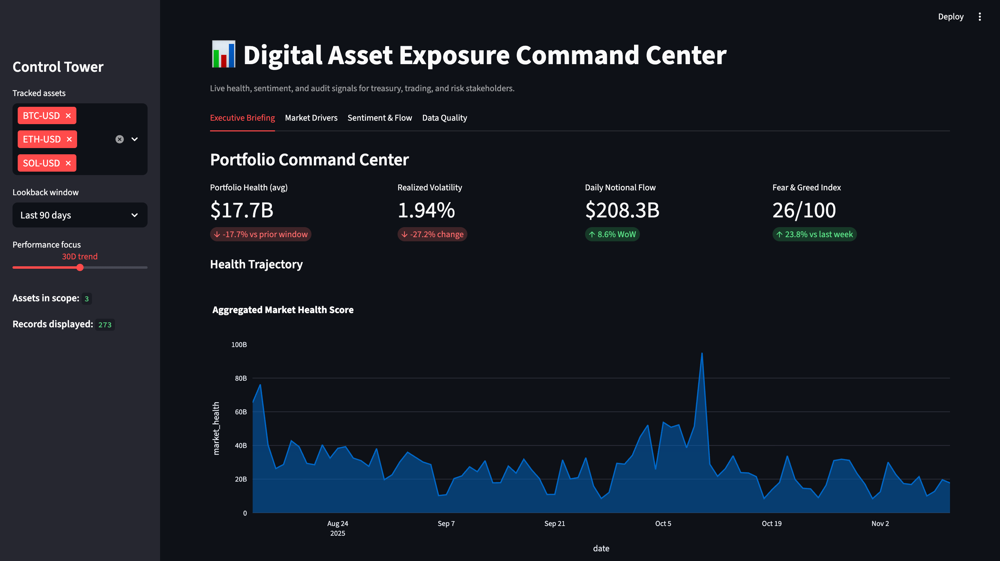
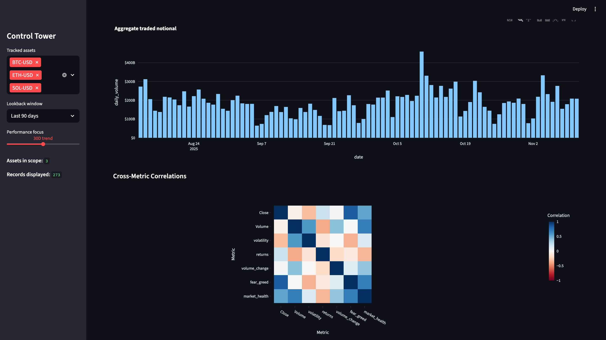
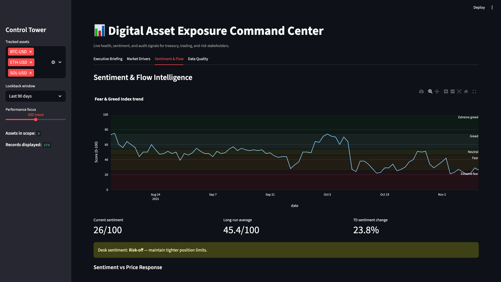
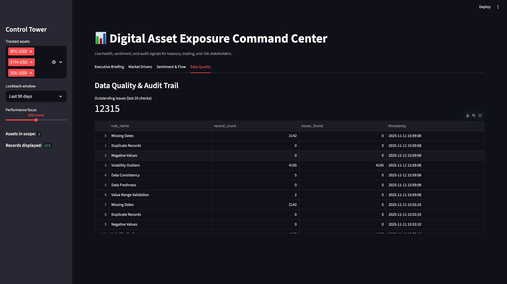

# Crypto Market Health & Sentiment Command Center

Live crypto intelligence workspace that unifies an automated ETL pipeline, ACL-style data quality audits, and a Streamlit dashboard so risk, treasury, and trading teams can see how price volatility, liquidity, and social sentiment shape investor confidence in real time.

---

## Table of Contents
1. [Why This Exists](#why-this-exists)
2. [System Highlights](#system-highlights)
3. [Solution Architecture](#solution-architecture)
4. [Data Sources & Metrics](#data-sources--metrics)
5. [Repository Map](#repository-map)
6. [Quick Start](#quick-start)
7. [Operating the Pipeline](#operating-the-pipeline)
8. [Database Schema](#database-schema)
9. [Dashboard Tour](#dashboard-tour)
10. [Automation & Ops Tips](#automation--ops-tips)
11. [Troubleshooting](#troubleshooting)
12. [Roadmap Ideas](#roadmap-ideas)

---

## Why This Exists
**Business question:**  
> *How do spot price volatility, traded volume, and social sentiment correlate with investor confidence for major cryptocurrencies?*

Answering that requires:
- Consistent, backfillable price and sentiment data.
- Derived metrics (returns, realized volatility, market health).
- A governance layer that flags data gaps, stale loads, or suspicious values.
- An interactive workspace for executives and desk teams.

This project delivers the full stack needed to go from raw market feeds to a production-ready command center.

---

## System Highlights
- **Parallel ETL ingestion** from Yahoo Finance (`yfinance`) and Alternative.me Fear & Greed API with retry logic, exponential backoff, and incremental-awareness hooks.
- **Feature engineering** for returns, rolling volatility, volume deltas, and a composite *Market Health Score* that links liquidity, stability, and sentiment.
- **Audit-grade data checks** (missing dates, duplicates, range violations, freshness, etc.) with results persisted for dashboard visibility.
- **Executive-ready Streamlit UI** spanning KPI tiles, momentum radar, liquidity pulse, sentiment overlays, and an audit tab.
- **SQLite persistence** so analysts can interrogate or extend the dataset with SQL without additional infrastructure.

---

## Solution Architecture
```
          +-------------------------+
          |  Yahoo Finance (OHLCV)  |
          +-----------+-------------+
                      |
                      |
          +-----------v-------------+
          |  Alternative.me F&G API |
          +-----------+-------------+
                      |
                      v
            [ etl_pipeline.py ]
    - concurrent extraction
    - feature engineering
    - quality guardrails
                      |
                      v
             SQLite: crypto_analytics.db
        (price_data, sentiment_index, combined_metrics)
                      |
        +-------------+-------------+
        |                           |
        v                           v
 [audit_checks.py]          [dashboard.py]
 - ACL-style rules          - Streamlit UI
 - audit_log table          - Tabs for Exec / Drivers /
                               Sentiment / Data Quality
```

---

## Data Sources & Metrics
| Domain | Source | Notes |
| --- | --- | --- |
| Market data | Yahoo Finance via `yfinance` | Daily OHLCV for BTC, ETH, SOL, BNB, DOGE (extendable). |
| Sentiment | Alternative.me Fear & Greed Index API | Historical + current sentiment (0–100). |

**Key derived metrics**
- `returns`: daily % change in closing price.
- `volatility`: 7-day rolling std of returns (realized vol proxy).
- `volume_change`: % change in traded notional.
- `market_health`: `Volume × (1 − volatility) × (fear_greed / 100)` – a fused signal balancing liquidity, calm, and sentiment.

---

## Repository Map
```
etl dashboard/
├── etl_pipeline.py      # Extract/transform/load workflow
├── audit_checks.py      # Data governance & rule logging
├── dashboard.py         # Streamlit command center
├── crypto_analytics.db  # SQLite store (generated)
├── requirements.txt     # Python dependencies
└── README.md
```

---

## Quick Start
1. **Python**: 3.9+ recommended.  
2. **Clone & enter repo**
   ```bash
   git clone <repo-url>
   cd "etl dashboard"
   ```
3. **Create virtual environment**
   ```bash
   python -m venv venv
   source venv/bin/activate        # Windows: venv\Scripts\activate
   ```
4. **Install dependencies**
   ```bash
   pip install --upgrade pip
   pip install -r requirements.txt
   ```

---

## Operating the Pipeline
### 1. Refresh the dataset
```bash
python etl_pipeline.py
```
- Fetches OHLCV data for configured tickers since 2020-01-01.
- Pulls the full Fear & Greed history.
- Computes derived metrics and writes three tables (`price_data`, `sentiment_index`, `combined_metrics`) into `crypto_analytics.db`.

> Tip: schedule this via cron/Airflow to refresh daily. For true incremental loads implement the `get_last_update_date` helper already wired in.

### 2. Run audit checks
```bash
python audit_checks.py
```
- Executes seven rule classes (missing dates, duplicates, negative values, volatility outliers, consistency, freshness, range checks).
- Appends results to `audit_log` with a timestamp so the dashboard can surface outstanding issues.

### 3. Launch the dashboard
```bash
streamlit run dashboard.py
```
Open the provided local URL to explore the command center. The app connects directly to the SQLite DB, so make sure the ETL job ran first.

---

## Database Schema
| Table | Purpose | Core Columns |
| --- | --- | --- |
| `price_data` | Cleaned OHLCV + engineered metrics per symbol/date. | `date`, `symbol`, `Open`, `High`, `Low`, `Close`, `Volume`, `returns`, `volatility`, `volume_change` |
| `sentiment_index` | Raw Fear & Greed history. | `date`, `fear_greed` |
| `combined_metrics` | Price + sentiment join plus `market_health`. | All price columns + `fear_greed`, `market_health` |
| `audit_log` | Result of each governance run. | `rule_name`, `record_count`, `issues_found`, `timestamp` |

SQLite keeps everything self-contained, but you can point the loaders to PostgreSQL/MySQL via SQLAlchemy if scaling up.

---

## Dashboard Tour
| Tab | What you'll see |
| --- | --- |
| **Executive Briefing** | KPI tiles for portfolio health, realized vol, notional flow, Fear & Greed. Area chart for aggregated market health, momentum bar chart, risk-vs-return scatter, and a latest-position datatable. |
| **Market Drivers** | Multi-asset trend lines (price, volume, volatility, market health), liquidity pulse bar chart, and a correlation heatmap to highlight metric relationships. |
| **Sentiment & Flow** | Annotated Fear & Greed timeline, qualitative guidance (risk-on/off), dual-axis plot overlaying sentiment with selected prices, and correlation diagnostics. |
| **Data Quality** | Live snapshot of the `audit_log`, including outstanding issues from the last 20 runs, so stakeholders trust the numbers before taking action. |

Sidebar controls let you choose tracked assets, lookback windows, and which momentum lens (7D / 30D / 90D) to emphasize.

---

## Visual Gallery
- **Executive Command Center**  
  
- **Market Drivers & Correlations**  
  
- **Sentiment Intelligence**  
  
- **Data Quality Cockpit**  
  

Each screenshot reflects a recent end-to-end run of the ETL + audit workflow so readers can see the actual outcomes the repo produces.

---

## Automation & Ops Tips
- **Scheduling**: Run `etl_pipeline.py` nightly, then `audit_checks.py`. If both succeed, deploy the Streamlit app (locally or hosted).
- **Alerting**: Hook `audit_log` into Slack/Teams (e.g., SELECT where `issues_found > 0`) to ensure data issues surface quickly.
- **Scalability**: Swap SQLite for a managed Postgres instance and adjust connection strings to unlock multi-user scenarios.
- **Extensibility**: Add more tickers via the `cryptos` list or plug in on-chain metrics / funding rates for richer health scores.

---

## Troubleshooting
- **Empty dashboard tables** → Run the ETL job; ensure `crypto_analytics.db` sits beside `dashboard.py`.
- **API rate limits / timeouts** → The pipeline already retries with exponential backoff; tune `max_retries` or stagger tickers if needed.
- **Stale data warnings** → `audit_checks.py` flags if `MAX(date)` is older than two days. Re-run ETL or inspect upstream availability.
- **Streamlit cache issues** → If schema changes, restart Streamlit or clear cache via `st.cache_data.clear()` to avoid stale frames.

---

## Roadmap Ideas
1. Real-time websocket ingestion for intraday monitoring.
2. Alerting rules (e.g., volatility > threshold) that page ops teams.
3. Portfolio what-if analysis: weights, VaR, stress scenarios.
4. API layer (FastAPI/Flask) to expose metrics to other systems.
5. CI pipeline that runs ETL + audit tests before deployment.

Feel free to fork, extend, and plug this into your own digital asset analytics stack. PRs welcome!
